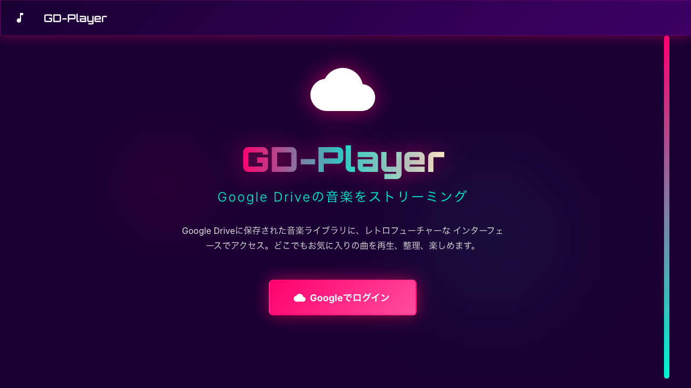

# 🎵 GD-Player

Google Driveに保存された音楽ファイルをレトロフューチャーなインターフェースで再生するWebアプリケーション。制作途中の楽曲を連続して確認したいという個人的なニーズと、関係者への共有や議事録へのリンク添付といった共同作業の要件を両立させるために開発されました。



## ✨ 主な機能

### 🎨 レトロフューチャーデザイン
ネオングロー効果とグラデーションを使用した80年代風の未来的なUI。ダークテーマをベースに、ネオンピンク・シアン・イエローのカラーパレットで統一されたデザイン。

### 🎵 カスタムオーディオプレーヤー
- 再生/一時停止、前後スキップ
- ドラッグ可能なシークバー
- 音量調整(iOS以外)
- 再生モード切替(連続再生/1曲リピート/なし)
- 固定フッターで常に操作可能

### 🎶 インタラクティブな音楽リスト
- カード形式の洗練されたリストデザイン
- 再生中の曲を自動強調表示
- ホバーエフェクトとスムーズなアニメーション
- 段階的な表示アニメーション

### 📁 フォルダ管理
- Google Driveのフォルダを追加・管理
- フォルダごとにフィルタリング
- フォルダごとのメモ機能

### 🔐 セキュアな認証
- HttpOnly Cookieによる安全なセッション管理
- バックエンドサーバーでのトークン管理
- リフレッシュトークンによる長期セッション(7日間)

### 🔗 共有機能
曲の共有リンクをワンクリックでコピー

### 📱 レスポンシブ対応
スマホ、タブレット、デスクトップに最適化

## 🏗 アーキテクチャ

このプロジェクトは **pnpm workspaces + Turborepo** によるモノレポ構成です。

```
music-player-monorepo/
├── apps/
│   ├── web/              # フロントエンド(React + Vite)
│   └── server/           # バックエンド(Express + TypeScript)
├── packages/
│   └── shared/           # 共通コード(型定義、ユーティリティ)
├── pnpm-workspace.yaml   # pnpmワークスペース設定
├── turbo.json            # Turborepo設定
└── package.json          # ルートpackage.json
```

### 技術スタック

**フロントエンド**:
- React 19 (TypeScript)
- Material-UI v7
- Framer Motion
- Vite
- Google OAuth 2.0

**バックエンド**:
- Node.js + Express
- TypeScript
- Google APIs Client
- HttpOnly Cookie認証

**モノレポ管理**:
- pnpm workspaces
- Turborepo (ビルドキャッシュ・並列実行)

**開発ツール**:
- TypeScript Project References
- ESLint 9 + Prettier
- Vitest (テスト)

## 🚀 セットアップ

### 前提条件

- **Node.js 20以上** (推奨)
- **pnpm 9.0以上**
- Google Cloud Platformのプロジェクト
- Google Drive API の有効化

### インストール

```bash
# pnpmがインストールされていない場合
npm install -g pnpm

# 依存関係をインストール
pnpm install

# 環境変数を設定
cp .env.example .env
# .env ファイルを編集して、認証情報を設定

# フロントエンド用 (.env)
VITE_GOOGLE_CLIENT_ID=your_client_id_here

# バックエンド用 (apps/server/.env)
GOOGLE_CLIENT_ID=your_client_id_here
GOOGLE_CLIENT_SECRET=your_client_secret_here
GOOGLE_REDIRECT_URI=http://localhost:3001/auth/google/callback
SESSION_SECRET=your_session_secret_here
```

### 開発

```bash
# 全体を開発モードで起動(フロントエンド + バックエンド)
pnpm dev

# フロントエンドのみ起動
pnpm dev:web

# バックエンドのみ起動
pnpm dev:server
```

### ビルド

```bash
# 全体をビルド
pnpm build

# フロントエンドのみビルド
pnpm build:web

# バックエンドのみビルド
pnpm build:server
```

### テスト

```bash
# 全体のテストを実行
pnpm test

# テストをウォッチモードで実行
pnpm --filter @music-player/server test:watch

# カバレッジレポートを生成
pnpm --filter @music-player/server test:coverage
```

### その他のコマンド

```bash
# Lint
pnpm lint

# Format
pnpm format

# Type Check
pnpm type-check

# クリーンアップ
pnpm clean
```

## 📖 使い方

1. Google アカウントでログイン
2. Google Driveのフォルダを追加
3. 音楽ファイルが自動的に読み込まれます
4. プレイリストから曲を選択して再生

## 🎨 デザインシステム

### カラーパレット

- **プライマリ**: #ff006e (ネオンピンク)
- **セカンダリ**: #00f5d4 (ネオンシアン)
- **アクセント**: #fbf8cc (ネオンイエロー)
- **背景**: #1a0033 (ディープパープル)

### タイポグラフィ

- **見出し**: Orbitron (700-900)
- **本文**: Inter (300-700)

## 📚 ドキュメント

- [ADR 001: セキュアな認証システムの実装](docs/adr/001-secure-authentication-with-backend.md)
- [ADR 002: モノレポアーキテクチャの採用](docs/adr/002-monorepo-architecture.md)
- [Google Cloud Consoleセットアップガイド](docs/GOOGLE_CLOUD_CONSOLE_SETUP.md)

## 🤝 コントリビューション

プルリクエストを歓迎します！大きな変更の場合は、まずissueを開いて変更内容を議論してください。

## 📝 ライセンス

MIT

## 🙏 謝辞

- Material-UI チーム
- Framer Motion チーム
- React コミュニティ
