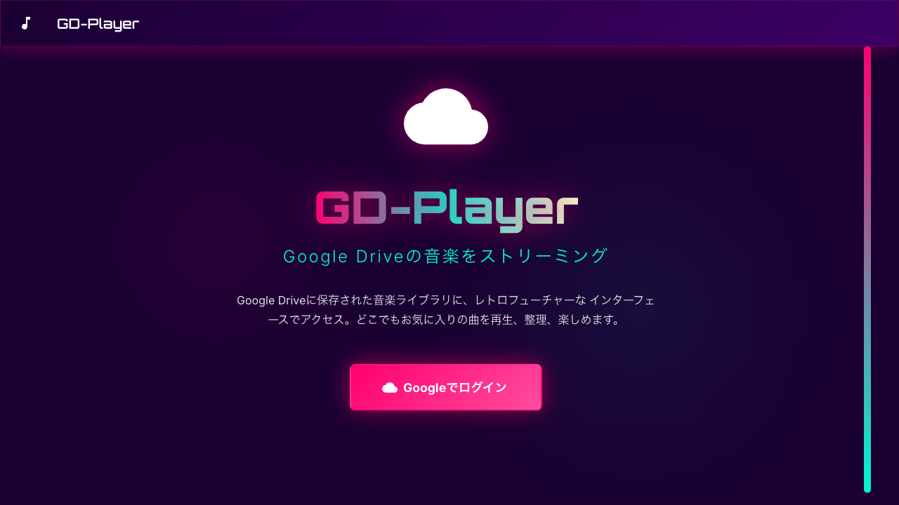

# 🎵 GD-Player

Google Driveに保存された音楽ファイルをレトロフューチャーなインターフェースで再生するWebアプリケーション。制作途中の楽曲を連続して確認したいという個人的なニーズと、関係者への共有や議事録へのリンク添付といった共同作業の要件を両立させるために開発されました。



## ✨ 主な機能

### 🎨 レトロフューチャーデザイン

ネオングロー効果とグラデーションを使用した80年代風の未来的なUI。ダークテーマをベースに、ネオンピンク・シアン・イエローのカラーパレットで統一されたデザイン。

### 🎵 カスタムオーディオプレーヤー

- 再生/一時停止、前後スキップ
- ドラッグ可能なシークバー
- 音量調整（iOS以外）
- 再生モード切替（連続再生/1曲リピート/なし）
- 固定フッターで常に操作可能

### 🎶 インタラクティブな音楽リスト

- カード形式の洗練されたリストデザイン
- 再生中の曲を自動強調表示
- ホバーエフェクトとスムーズなアニメーション
- 段階的な表示アニメーション

### 📁 フォルダ管理

- Google Driveのフォルダを追加・管理
- フォルダごとにフィルタリング
- フォルダごとのメモ機能
- フォルダごとの `TODO.md` を Google Drive 上で同期

### 🔗 共有機能

曲の共有リンクをワンクリックでコピー

### 📱 レスポンシブ対応

スマホ、タブレット、デスクトップに最適化

## 🛠 技術スタック

- **フレームワーク**: React 18 (TypeScript)
- **UIライブラリ**: Material-UI v7
- **アニメーション**: Framer Motion
- **ビルドツール**: Vite
- **認証**: Google OAuth 2.0
- **API**: Google Drive API v3
- **PWA対応**: Workbox

## 🎨 デザインシステム

### カラーパレット

- **プライマリ**: #ff006e (ネオンピンク)
- **セカンダリ**: #00f5d4 (ネオンシアン)
- **アクセント**: #fbf8cc (ネオンイエロー)
- **背景**: #1a0033 (ディープパープル)

### タイポグラフィ

- **見出し**: Orbitron (700-900)
- **本文**: Inter (300-700)

### 主要コンポーネント

- **CustomAudioPlayer**: フルカスタムの音楽プレイヤーUI
- **テーマシステム**: Material-UIのカスタムテーマ
- **アニメーション**: Framer Motionのバリアント定義
- **スタイルエフェクト**: 再利用可能なグロー・グラデーション効果

## 🚀 セットアップ

### 前提条件

- Node.js 18以上
- Google Cloud Platformのプロジェクト
- Google Drive API の有効化

### インストール

```bash
# 依存関係をインストール
npm install

# 環境変数を設定
# .env ファイルを作成し、Google OAuth クライアントIDを設定
VITE_GOOGLE_CLIENT_ID=your_client_id_here

# Notion 手動同期を使う場合
VITE_NOTION_SYNC_PAGE_ID=your_notion_page_id_here
NOTION_API_KEY=your_notion_integration_secret

# WebSocket リアルタイム同期を使う場合
VITE_SYNC_WEBSOCKET_URL=wss://your-sync-server.example.com

# 開発サーバーを起動
npm run dev
```

### ビルド

```bash
# プロダクションビルド
npm run build

# ビルドをプレビュー
npm run preview
```

## 📖 使い方

1. **ログイン**: Googleアカウントでログイン
2. **フォルダ追加**: "Add Folder"ボタンから音楽が保存されたGoogle DriveフォルダのIDを追加
3. **再生**: 曲リストから再生したい曲を選択
4. **操作**: カスタムプレイヤーで再生/一時停止、前後スキップ、音量調整
5. **共有**: 共有アイコンから曲のリンクをコピー
6. **制作TODO運用**: 曲フォルダを選んで `メモ` を開くと、そのフォルダ内の `TODO.md` を自動で読み込みます。保存すると同じ Drive フォルダ内の `TODO.md` を更新します。
7. **Notion同期**: `VITE_NOTION_SYNC_PAGE_ID` と `NOTION_API_KEY` を設定すると、`メモ` 画面から `Notionから読込` / `Notionへ保存` が使えます。Notion の親ページ配下から曲フォルダ名と同名のページを探し、その曲ページ内の `# Todo` セクションにある `App TODO` トグルだけを同期します。
8. **リアルタイム同期**: `VITE_SYNC_WEBSOCKET_URL` を設定すると、フォルダ一覧とメモの変更を WebSocket 経由で他の画面へ同期します。未設定でも同じブラウザ内の別タブは BroadcastChannel で同期します。

## 🎛 iPhone PWA での TODO 運用

- Ableton Project と 1 対 1 対応している Google Drive フォルダを追加します
- 各曲フォルダの中に、音源ファイルと同じ階層で `TODO.md` を管理します
- iPhone の PWA で曲フォルダを選択し、`メモ` から TODO を確認・更新します
- `Driveに保存` を押すと、そのフォルダの `TODO.md` を新規作成または上書きします
- Notion 同期を有効にすると、同じ TODO を曲ページ内の `# Todo` > `App TODO` トグルに手動で退避できます
- `All Folders` 選択中は、どの曲の TODO か特定できないためメモ機能は使いません
- 既存ユーザーは Drive 書き込み権限が必要になるため、一度ログアウトして再ログインしてください

## 📝 Notion 手動同期

- 対象ページは `VITE_NOTION_SYNC_PAGE_ID` で指定します。ここには曲ページではなく、曲ページを含む親ページを設定します。
- API キーはサーバー側の `NOTION_API_KEY` にのみ置き、フロントには出しません
- アプリは曲フォルダ名と同名の Notion 子ページを探し、そのページ内の `# Todo` セクションにある `App TODO` トグルだけを更新します
- `# Todo` が無い場合は作成します。既存の `# 絵`、`# テーマ`、`# ナレッジ`、`# 歌詞` などは壊しません
- `Notionから読込` はトグル内のチェックリストをローカル TODO に取り込みます
- `Notionへ保存` は現在のローカル TODO をトグル内のチェックリストへ上書き保存します

## ✅ 本番投入前チェック

- Vercel の環境変数に `NOTION_API_KEY` を設定する
- フロント用の環境変数に親ページの `VITE_NOTION_SYNC_PAGE_ID` を設定する
- 親ページと同期対象の曲ページを integration に共有する
- 曲フォルダを1つ選び、`Notionへ保存` を押して曲ページ内の `# Todo` に `App TODO` トグルが作られることを確認する
- Notion 側でチェック状態を1件変え、`Notionから読込` でアプリ側へ反映されることを確認する
- `感覚メモ` や同期対象外の本文が壊れていないことを確認する
- Drive と Notion を両方使う場合、`Driveに保存` と `Notionへ保存` をそれぞれ1回ずつ試して期待どおり共存することを確認する

## 📋 アーキテクチャ決定記録 (ADR)

重要な技術的意思決定は [ADR (Architecture Decision Records)](./docs/adr/) として文書化しています。

主な決定事項:

- [ADR-0001: Framer Motion をアニメーションライブラリとして使用する](./docs/adr/0001-use-framer-motion-for-animations.md)

詳しくは [docs/adr/README.md](./docs/adr/README.md) を参照してください。

## 🎯 今後の予定

- プレイリスト機能の追加
- 検索機能の実装
- お気に入り機能
- ダークモード/ライトモードの切り替え
- 他のクラウドストレージ対応

## 📱 モバイル対応

### iOS対応

- iOS Safariでの音量制御は、OSのセキュリティ制限により端末の物理ボタンで行ってください
- その他の機能は完全に動作します

### PWA対応

- ホーム画面に追加してアプリのように使用可能
- オフラインでも一部機能が利用可能

## 🐛 トラブルシューティング

### Google Driveの音楽が表示されない

1. フォルダIDが正しいか確認してください
2. フォルダの共有設定を確認してください
3. 音楽ファイルが`audio/`のMIMEタイプを持っているか確認してください

### 音楽が再生されない

1. ブラウザがaudioフォーマットをサポートしているか確認してください
2. Google Driveへのアクセス権限を再確認してください
3. ネットワーク接続を確認してください

### ログアウトしたい

画面右上の"Logout"ボタンをクリックしてください

## 🙏 謝辞

このプロジェクトは以下のライブラリを使用しています：

- React & TypeScript
- Material-UI
- Framer Motion
- Google APIs

## ⚠️ 免責事項

このアプリケーションは個人的な用途のために開発されたものです。使用する場合は**自己責任**でお願いします。

- データの損失や破損について一切の責任を負いません
- Google Drive APIの使用制限や料金については各自で確認してください
- セキュリティやプライバシーに関する問題について責任を負いません
- 予告なく機能の変更や削除を行う場合があります

本アプリケーションの使用により生じたいかなる損害についても、開発者は責任を負わないものとします。

## 📄 ライセンス

MIT License

Copyright (c) 2026

本プロジェクトは個人開発として提供されています。利用に伴うリスクや責任はすべて利用者自身に帰属します。

ソフトウェアは「現状有姿」で提供され、明示・黙示を問わず一切の保証を行いません。商品の品質や特定目的への適合性、権利非侵害性についても保証できません。ソフトウェアの使用や利用により発生したいかなる損害や問題についても、開発者は責任を負いません。
